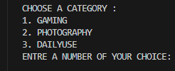
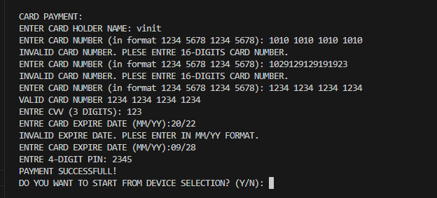

# Mobile-Phone-Selection-System
Python-based mobile phone selection system with payment processing
# 📱 Mobile Phone Selection System

A **Python-based console application** that helps users select mobile phones based on their needs (Gaming, Photography, Daily Use) and process payments securely.

## ✨ **Features**

| **Category** | **Devices** | **Key Features** |
|-------------|-------------|-----------------|
| **🎮 Gaming** | ASUS ROG Phone 8 Pro, NUBIA RedMagic 9 Pro | High-performance gaming phones |
| **📸 Photography** | Samsung S24 Ultra, iPhone 15 Pro Max | Professional camera systems |
| **📱 Daily Use** | Blackphone 2, Katim RO1 | Balanced performance & security |

### **🔒 Payment System**
- **Card Payment**: 16-digit validation, CVV, expiry date, PIN
- **Installment Plans**: 12/24/36 months with interest calculation
- **Input Validation**: Regex patterns for secure transactions

## 🖼️ **Screenshots**

| **Category Selection** | **Gaming Options** | **Device Specifications** |
|----------------------|------------------|-------------------------|
|  |  |  |

| **Payment Options** | **Card Validation** |
|-------------------|-------------------|
|  |  |


## 🚀 **How to Run**

1. **Clone the repository**:
   ```bash
   git clone https://github.com/YOUR_USERNAME/Mobile-Phone-Selection-System.git
